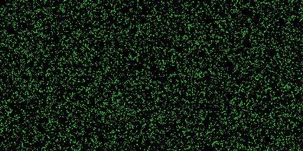

# AutomataVTK

Multi-dimensional Cellular Automata visualization using Python's VTK bindings on top of a CUDA-parallel grid updates.

The project consists of a Proof-of-concept for a general multidimensional CA real-time visualizer. Each file consists of an implementation of one CA simulation (most of which are also built with CUDA update kernels). Although the final visualizer's base graphics may not be built on the VTK library, this POC uses it alongside PyVista for a clearer numpy arrays compatibility layer.

